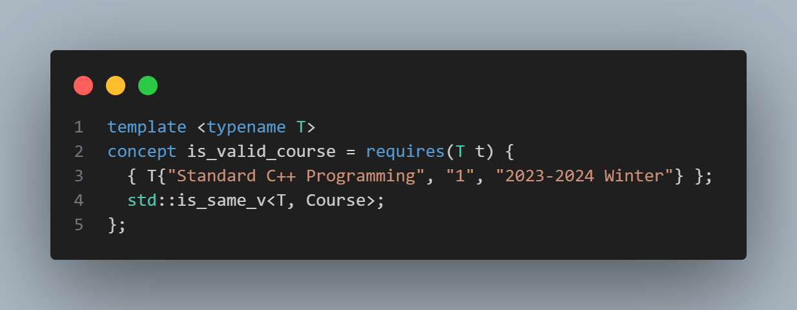

# 【CS106L SPRING 2025】 Assignment学习总结

## 课程介绍

课程主页：[CS106L: Standard C++ Programming](https://web.stanford.edu/class/cs106l/index.html)

课程内容：CS106L 是有关现代 C++ 的一门课，包含了 C++ 很多有趣的特性，涉及的内容一直到 C++26

学习感悟：我在学习这门课的时候，只做了 assignment，并没有阅读 slide 和 lecture code，所以在学习过程中有一点吃力。不过 assignment 的引导还是做的很好的，在不知道课程内容的情况下，仅靠查阅 cpp reference 和给出的参考资料就能够完成全部内容，并且了解到 cpp 的新特性。总体而言，这门课程讲解了比较现代的 C++ 特性。从开始的流输入输出，STL，到类的继承，再到模板元编程、运算符重载，到最后的 RAII。

个人仓库：[GitHub - singularityu820/cs106l](https://github.com/singularityu820/cs106l)

## Assignment 1: SimpleEnroll

任务一不是很难，只是让大家快速进入状态，核心目标很简单：处理一份课程 CSV 数据，最终拆分成 “已开设课程” 和 “未开设课程” 两个文件。

### Part 0: Read the code and fill in the `Course` struct

这一部分需要定义 `Course` struct 中变量的类型，阅读代码，转到 `is_valid_course<Course>` 的定义，发现具体内容如下
 那么根据代码我们就可以知道，三个成员变量都应该是 `std::string` 。

### Part 1: `parse_csv`

根据 README 的指引，首先我们需要了解 `split` 函数。阅读源码，我们可以知道， `split` 接受 `std::string` 和 `char` 作为输入，一个是待分割的字符串，一个是分隔的标记符，输出结果是一个 `vector` 。
那么我们就可以往下进行，首先将文件按行输入，然后每行做一个 `split` ，然后将分割出来的数组放入 `courses` 中。
文件输入就运用到了 C++ 中的 `<fstream>` 头文件
这样就处理完成了，注意 README 中提醒的跳过表头

### Part 2: `write_courses_offered`

这个函数要求往文件中写入不是 `null` 的课程，并清理已写入的课程。
首先要特殊输出第一行
然后我在这里使用的是 `for` 循环，但是在后面学习过了以后，也可以使用 `std::range:：for_each` 。
阅读 `utils.cpp` 找到了 `delete_elem_from_vector` 辅助函数，同样的也可以直接使用后面的 `erase_if` 。

### Part 3: `write_courses_not_offered`

和 **Part 2** 的逻辑是一样的。

## Assignment 2: Marriage Pact

本次任务聚焦于 STL 容器（`std::set`/`std::unordered_set`、`std::queue`）和指针的使用，核心目标是从学生名单中筛选出与指定姓名拥有相同首字母的 “匹配对象”，流程包括读取数据、筛选匹配、选择结果三个主要步骤。

### Part 0: Setup

输入自己的名字即可

### Part 1: Get all applicants

从 `students.txt` 中读取所有学生姓名，存储到一个 `std::set` （有序集合）或 `std::unordered_set` （无序集合）中。我直接用的 `std::set` ，没有做修改。

### Part 2: Find matches

从 `get_applicants` 得到的集合中，筛选出与参数 `name` ）首字母相同的姓名，将这些姓名的**指针**存入 `std::queue` 中。
主要是辅助函数的创建，也是类似 split 的方法，找到空格作为分隔符，分别查看两个部分的首字母。当然也可以使用 `std::views` 进行串联处理。
`get_match` 函数就是自由发挥了

## Assignment 3: Make a Class

本次任务要求创建一个自定义 C++ 类，需满足构造函数重载、成员变量 / 函数访问控制、`const` 正确性等要求，并在 `sandbox.cpp` 中实例化该类。

### Part 1: Making your class

这个任务没有什么具体要求，就是自己任意写一个类就行

## Assignment 4: Ispell

这个是我感觉最繁琐的一项任务了，因为要求不能使用任何for或者while循环，全都使用STL实现，用到的都是比较新的特性。

本次任务需实现一个简易拼写检查器（Ispell）的核心逻辑，重点运用 STL 算法（`<algorithm>`）和 C++20 范围库（`std::ranges::views`），禁止使用 `for`/`while` 循环。核心目标是：
1. 将输入文本分割为结构化的 “token”（`tokenize` 函数）；
2. 根据字典检查 token 拼写正确性，并为错误拼写生成建议（`spellcheck` 函数）。

### `tokenize`

根据 README 中给出的步骤，一步步进行即可。
首先找出所有指向空格字符的迭代器，直接使用 `utils.cpp` 中的 `find_all` 函数即可，传入迭代器和 `isspace` 就行了。
然后在空格字符之间生成词元，使用transform和inserter搭配。
最后用 `std::erase_if` 移除内容为空的 `Token`（如连续空白导致的空字符串）。

### `spellcheck`

对比 `Corpus` （token 集合）和 `Dictionary` （正确词集合），找出拼写错误的 token，并为每个错误生成 “编辑距离为 1” 的建议词，最终返回 `std::set<Misspelling>` 。

首先，过滤正确拼写的 token，用 `std::ranges::views::filter` 筛选出不在字典中的 token（错误拼写）。
然后，生成建议词并转换为 Misspelling，用 `rv::transform` 将每个错误 token 转换为 `Misspelling` （含建议词）。
最后，再次用 `rv::filter` 移除建议词为空的 `Misspelling`，最终将结果转换为 `std::set<Misspelling>` 并返回。

## Assignment 5: Treebook

本次任务聚焦于 C++ 类的运算符重载、友元函数及特殊成员函数（SMF）的实现，核心目标是完善 `User` 类的功能，解决内存管理问题，并支持基本的用户操作（如打印、添加好友等）。`User` 类使用原始指针数组存储好友列表，因此需重点处理内存拷贝与释放，避免浅拷贝导致的问题。

### Part 1: Viewing Profiles

通过 `std::ostream` 输出 `User` 对象的信息，格式为 `User(name=xxx, friends=[xxx, xxx])`。

### Part 2: Unfriendly Behaviour

`User` 类使用原始指针 `_friends` 存储好友，默认生成的特殊成员函数会导致**浅拷贝**（仅复制指针地址，而非数据），引发双重释放或悬垂指针问题。需手动实现 / 删除部分特殊成员函数。
需要实现析构函数，拷贝构造函数，拷贝赋值函数，删除移动构造与移动赋值

### Part 3: Always Be Friending

实现 `operator+=`（添加好友）和 `operator<`（用户比较），均为成员函数。

## Assignment 6: Explore Courses

本次任务聚焦于 `std::optional` 的使用，核心目标是实现一个课程查找功能，并利用 `std::optional` 的 “单子操作”（monadic operations）处理查找结果，避免使用条件判断（如 `if`）。任务基于与 Assignment 1 相同的课程数据（`courses.csv`），需完成 `find_course` 函数和 `main` 函数中的结果处理逻辑。

### Part 0: Include `<optional>`

直接引入 `<optional>` 就可以

### Part 1: Write the `find_course` function

在实现查找功能时，我们可以借助标准库中的`std::find_if`算法高效完成任务。该函数会遍历容器元素，并对每个元素应用传入的判断条件（谓词）。当找到第一个满足条件的元素时，它会立即返回指向该元素的迭代器；若遍历完整个容器都未找到符合条件的元素，则返回容器的尾迭代器。

### Part 2: Modifying the `main` function

文章中介绍了三个 monadic 函数：

1. `transform` :若 `optional` 有值，对值应用函数并返回 “包含结果的 `optional` ”；否则返回 `nullopt` 。
2. **`or_else`**：若 `optional` 有值，直接返回该 `optional`；否则调用函数并返回其结果（`optional` 类型）。
3. **`and_then`**：若 `optional` 有值，对值应用函数（返回 `optional`）并返回该结果；否则返回 `nullopt`。

使用 `transform` 处理 “找到课程” 的情况，然后使用 `or_else` 处理 “未找到课程” 的情况

但是在C++23 中，有一个更方便的操作 `value_or` ，若 `optional` 包含值时返回该值，而在 `optional` 为空时返回一个提供的默认值，具体可以见我的实现。

## Assignment 7: Unique Pointer

本次任务聚焦于实现一个简化版的 `std::unique_ptr`，并通过它管理单链表，深刻理解智能指针、RAII（资源获取即初始化）、移动语义等现代 C++ 特性。任务分为两部分：首先实现 `unique_ptr` 的核心功能与特殊成员函数；然后使用该智能指针构建链表，并将 `std::vector` 转换为链表。

### Part 1: Implementing `unique_ptr`

首先是确定私有成员和基本构造函数，然后是重载指针操作符，最后实现RAII 与特殊成员函数，确保资源自动释放，禁止拷贝，支持移动语义。

### Part 2: Using `unique_ptr`

将 `std::vector<T>` 转换为链表（ `unique_ptr<ListNode<T>>` ），主要就是注意示例中的顺序。

## 后记

CS106L 的学习告一段落，但其实上还是剩了一些收尾的工作。往期三个比较重要的 lab 还没有做，然后也应该看一下 PPT，了解一下移动语义等相关知识。
